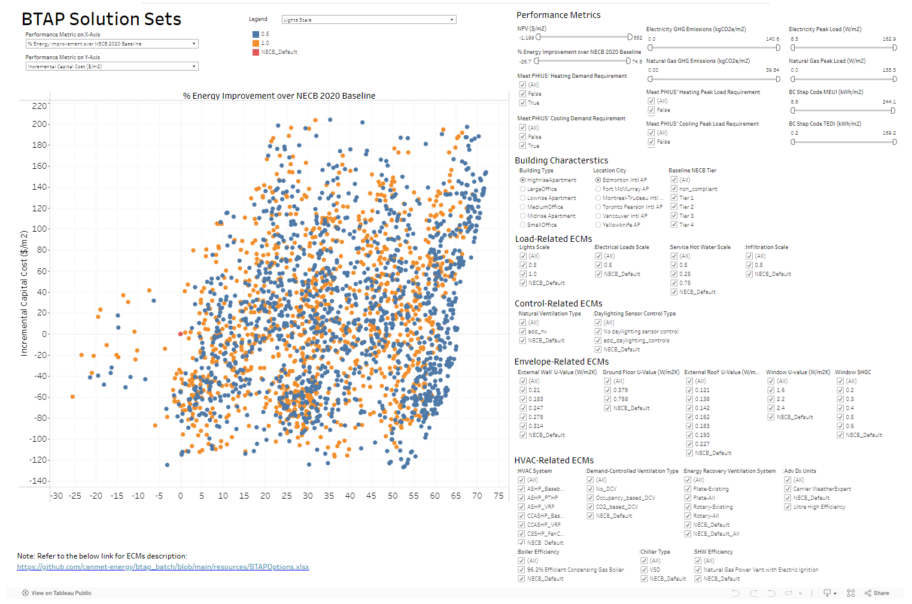
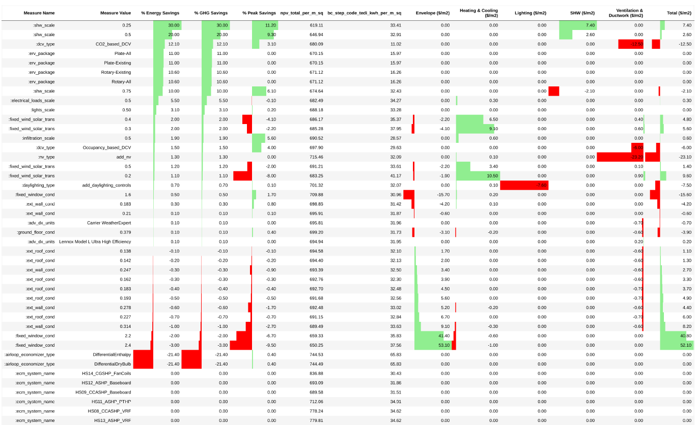
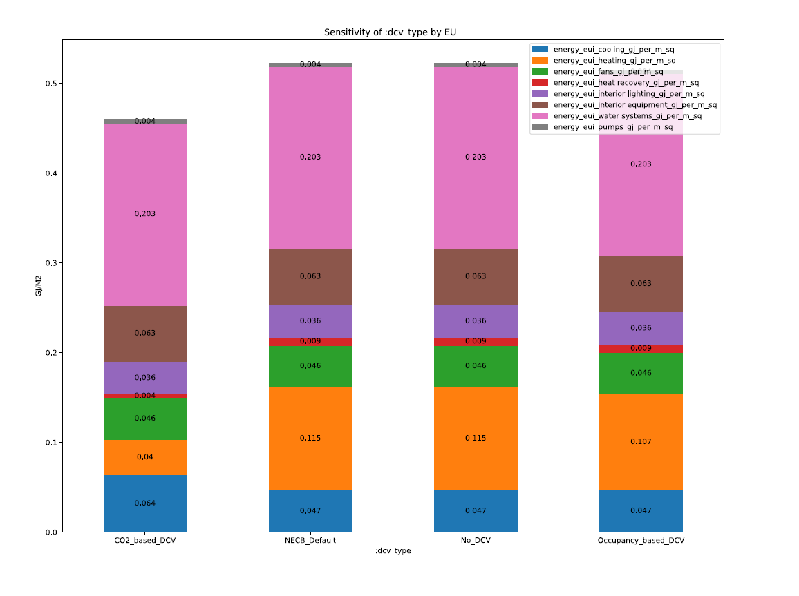
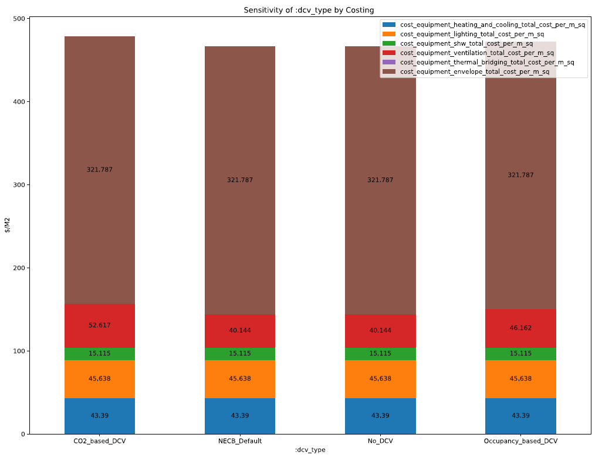

# BTAP Solution Sets 

This repository contains outputs of simulation runs that examines cost-effective paths to high performance buildings 
from the Building Technology Assement Platform (BTAP) developed by Natural Resources Canada's CanmetENERGY Ottawa 
Housing and Buildings Group.

BTAP was created to quickly generate buildings based on the National Energy Code for Buildings (NECB) and to determine 
possible packages of technologies that can be used to acheive higher energy efficiency optimizing capital investments. 

Some unique features of BTAP:

* NECB Rulesets allow quick generation of NECB models for all locations and NaturalGas, Electricity and HP baseline systems.
* Dynamic Costing that automatically accounts for load/sizing change costs for heating and cooling equipment.  Using RSMeans 2020 data. 
* Operational GHG accounting using rate from [Portolio Manager 2020](https://github.com/NREL/openstudio-standards/blob/master/lib/openstudio-standards/standards/necb/common/btap_data.rb#L1899)
* Utility Costs using Canada Energy Board 2021 [rates](https://github.com/NREL/openstudio-standards/blob/master/lib/openstudio-standards/standards/necb/common/neb_end_use_prices.csv).

* The most common used cases for BTAP is to:

* quickly generate NECB archetypes for 2011 through 2020 for any building type and location.
* examine the cost/performance of the National Energy Code for buildings in all locations in Canada.
* examine cost-effective design pathways to high performance buildings.

While BTAP can operate on any building type and location in Canada, below are analyses of examining 5 Building types in 6 cities in Canada. 
You can download the geometry file in the hyperlinks below to review the geometry in [OpenStudio/Sketchup Plugin](https://openstudiocoalition.org/reference/sketchup_plugin_interface/)

*  [HighriseApartment](https://github.com/NREL/openstudio-standards/blob/master/lib/openstudio-standards/standards/necb/NECB2011/data/geometry/HighriseApartment.osm)
*  [LargeOffice](https://github.com/NREL/openstudio-standards/blob/master/lib/openstudio-standards/standards/necb/NECB2011/data/geometry/LargeOffice.osm)
*  [LowriseApartment](https://github.com/NREL/openstudio-standards/blob/master/lib/openstudio-standards/standards/necb/NECB2011/data/geometry/LowriseApartment.osm)
*  [MediumOffice](https://github.com/NREL/openstudio-standards/blob/master/lib/openstudio-standards/standards/necb/NECB2011/data/geometry/MediumOffice.osm)
*  [MidriseApartment](https://github.com/NREL/openstudio-standards/blob/master/lib/openstudio-standards/standards/necb/NECB2011/data/geometry/MidriseApartment.osm)
*  [SmallOffice](https://github.com/NREL/openstudio-standards/blob/master/lib/openstudio-standards/standards/necb/NECB2011/data/geometry/SmallOffice.osm)

## Optimization Analysis
 
The goal of this analysis was to determine what where the cost-effective solutions that could acheive highest performance
at the lowest incremental cost to the owner/builder with a variety of energy conservation packages. BTAP used machine learning using 
[optimization](https://www.google.com/search?q=nsga2&oq=nsga2&gs_lcrp=EgZjaHJvbWUyBggAEEUYOdIBCDE1NjVqMGoxqAIAsAIA&sourceid=chrome&ie=UTF-8) 
with [statistical sampling methods](https://en.wikipedia.org/wiki/Latin_hypercube_sampling) coupled with high performance 
computing to generate over one hundred thousand solutions for the buildings under examinination. 

The high level results for this are contained in the [zipped csv](data/solutions_sets.zip) file that you can download and examine. 

To better visualize the data, a [Tableau dashboard](https://public.tableau.com/app/profile/sara.gilani/viz/BTAP-Solution-Sets/DB_SolutionSets?publish=yes) was created to explore the solution space. 

You can use the radio buttons to filter in or out technologies to show the incremental cost and energy savings.  You can 
hover your mouse over each datapoint to view the technologies used in that "package". 

## Sensitivity Reports

BTAP can also generate a sensitvity analysis for a range of energy conservation measures. This is useful to determine 
the impact of single technologies on a reference building. This analysis reported the following changes for each indiidual 
measure (Red is worse, Green is Better): 

* % Energy Savings: Savings from the baseline model. 
* % GHG Savings: Saving in operational GHG from the baseline model. 
* % Peak Savings: The percent reduction in eletric peak demand.
* Net-Present Value (NPV): Using a 
* Thermal Energy Demand Intensity (TEDI)
* Envelope: Change in cost for building envelope. 
* Heating & Cooling: Change in capital cost for Heating and Cooling Equipment
* Lighting: Change in capital cost for lighting systems
* Service Hot Water (SHW): Change in capital cost for SHW equipment
* Ventilation & Ductwork: Change in capital cost for ventilation and ductwork. 
* Total: Change in capital costs considering all components mentioned above. 

Also included in the report is the EUI,  

 and cost breakdown for each ECM.

Here are links to all the reports generated for 60 buildings. 6 cities, 5 building types, and 2 baseline fuel types. 

| **Building Type**     	| **Baseline Heating Source** 	| **Vancouver** 	                                               | **Toronto** 	                                                  | **Montreal** 	                                                     | **Edmonton** 	                                                | **Fort McMurray** 	                                                     | **Yellowknife** 	                                                   |
|-----------------------	|-----------------------------	|---------------------------------------------------------------|----------------------------------------------------------------|--------------------------------------------------------------------|---------------------------------------------------------------|-------------------------------------------------------------------------|---------------------------------------------------------------------|
| **MediumOffice**       	| **Electricity**             	| [pdf](reports/MediumOffice_Electricity_YVR_sens.pdf)        	 | [pdf](reports/MediumOffice_Electricity_YYZ_sens.pdf)         	 | [pdf](reports/MediumOffice_Electricity_YUL_sens.pdf)             	 | [pdf](reports/MediumOffice_Electricity_YEG_sens.pdf)        	 | [pdf](reports/MediumOffice_Electricity_YMM_sens.pdf)                  	 | [pdf](reports/MediumOffice_Electricity_YZF_sens.pdf)              	 |
| **MediumOffice**       	| **NaturalGas**              	| [pdf](reports/MediumOffice_NaturalGas_YVR_sens.pdf)        	 | [pdf](reports/MediumOffice_NaturalGas_YYZ_sens.pdf)         	 | [pdf](reports/MediumOffice_NaturalGas_YUL_sens.pdf)             	 | [pdf](reports/MediumOffice_NaturalGas_YEG_sens.pdf)        	 | [pdf](reports/MediumOffice_NaturalGas_YMM_sens.pdf)                  	 | [pdf](reports/MediumOffice_NaturalGas_YZF_sens.pdf)              	 |
| **LargeOffice**       	| **Electricity**             	| [pdf](reports/LargeOffice_Electricity_YVR_sens.pdf)        	 | [pdf](reports/LargeOffice_Electricity_YYZ_sens.pdf)         	 | [pdf](reports/LargeOffice_Electricity_YUL_sens.pdf)             	 | [pdf](reports/LargeOffice_Electricity_YEG_sens.pdf)        	 | [pdf](reports/LargeOffice_Electricity_YMM_sens.pdf)                  	 | [pdf](reports/LargeOffice_Electricity_YZF_sens.pdf)              	 |
| **LargeOffice**       	| **NaturalGas**              	| [pdf](reports/LargeOffice_NaturalGas_YVR_sens.pdf)        	 | [pdf](reports/LargeOffice_NaturalGas_YYZ_sens.pdf)         	 | [pdf](reports/LargeOffice_NaturalGas_YUL_sens.pdf)             	 | [pdf](reports/LargeOffice_NaturalGas_YEG_sens.pdf)        	 | [pdf](reports/LargeOffice_NaturalGas_YMM_sens.pdf)                  	 | [pdf](reports/LargeOffice_NaturalGas_YZF_sens.pdf)              	 |
| **LowriseApartment**       	| **Electricity**             	| [pdf](reports/LowriseApartment_Electricity_YVR_sens.pdf)        	 | [pdf](reports/LowriseApartment_Electricity_YYZ_sens.pdf)         	 | [pdf](reports/LowriseApartment_Electricity_YUL_sens.pdf)             	 | [pdf](reports/LowriseApartment_Electricity_YEG_sens.pdf)        	 | [pdf](reports/LowriseApartment_Electricity_YMM_sens.pdf)                  	 | [pdf](reports/LowriseApartment_Electricity_YZF_sens.pdf)              	 |
| **LowriseApartment**       	| **NaturalGas**              	| [pdf](reports/LowriseApartment_NaturalGas_YVR_sens.pdf)        	 | [pdf](reports/LowriseApartment_NaturalGas_YYZ_sens.pdf)         	 | [pdf](reports/LowriseApartment_NaturalGas_YUL_sens.pdf)             	 | [pdf](reports/LowriseApartment_NaturalGas_YEG_sens.pdf)        	 | [pdf](reports/LowriseApartment_NaturalGas_YMM_sens.pdf)                  	 | [pdf](reports/LowriseApartment_NaturalGas_YZF_sens.pdf)              	 |
| **MidriseApartment**       	| **Electricity**             	| [pdf](reports/MidriseApartment_Electricity_YVR_sens.pdf)        	 | [pdf](reports/MidriseApartment_Electricity_YYZ_sens.pdf)         	 | [pdf](reports/MidriseApartment_Electricity_YUL_sens.pdf)             	 | [pdf](reports/MidriseApartment_Electricity_YEG_sens.pdf)        	 | [pdf](reports/MidriseApartment_Electricity_YMM_sens.pdf)                  	 | [pdf](reports/MidriseApartment_Electricity_YZF_sens.pdf)              	 |
| **MidriseApartment**       	| **NaturalGas**              	| [pdf](reports/MidriseApartment_NaturalGas_YVR_sens.pdf)        	 | [pdf](reports/MidriseApartment_NaturalGas_YYZ_sens.pdf)         	 | [pdf](reports/MidriseApartment_NaturalGas_YUL_sens.pdf)             	 | [pdf](reports/MidriseApartment_NaturalGas_YEG_sens.pdf)        	 | [pdf](reports/MidriseApartment_NaturalGas_YMM_sens.pdf)                  	 | [pdf](reports/MidriseApartment_NaturalGas_YZF_sens.pdf)              	 |
| **HighriseApartment**       	| **Electricity**             	| [pdf](reports/HighriseApartment_Electricity_YVR_sens.pdf)        	 | [pdf](reports/HighriseApartment_Electricity_YYZ_sens.pdf)         	 | [pdf](reports/HighriseApartment_Electricity_YUL_sens.pdf)             	 | [pdf](reports/HighriseApartment_Electricity_YEG_sens.pdf)        	 | [pdf](reports/HighriseApartment_Electricity_YMM_sens.pdf)                  	 | [pdf](reports/HighriseApartment_Electricity_YZF_sens.pdf)              	 |
| **HighriseApartment**       	| **NaturalGas**              	| [pdf](reports/HighriseApartment_NaturalGas_YVR_sens.pdf)        	 | [pdf](reports/HighriseApartment_NaturalGas_YYZ_sens.pdf)         	 | [pdf](reports/HighriseApartment_NaturalGas_YUL_sens.pdf)             	 | [pdf](reports/HighriseApartment_NaturalGas_YEG_sens.pdf)        	 | [pdf](reports/HighriseApartment_NaturalGas_YMM_sens.pdf)                  	 | [pdf](reports/HighriseApartment_NaturalGas_YZF_sens.pdf)              	 |

## Known Issues
In the last update with NREL's Openstudio and EnergyPlus. There were discrepencies in HeatPump and SHW Pump Energy. These will be updated by April 30th, 2024
